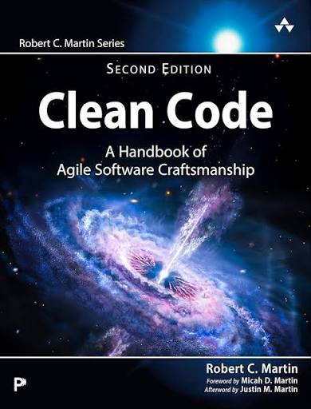

# 📚 Sam's Bookstore

A modern and responsive online bookstore built with **React, TypeScript, Tailwind CSS, and React Router**.

The project demonstrates a complete shopping flow where users can browse developer-focused books, view product details, manage their cart, and complete a checkout process.

## 🚀 Live Demo

> Coming soon — deployed version will be added here.

## 📸 Preview

### Home Page



## ✨ Features

* 📚 Browse developer and programming books
* 🔎 View detailed information for each book
* 🛒 Add books to the shopping cart
* ➕ Increase product quantity
* ➖ Decrease product quantity
* 🗑️ Remove products from the cart
* 🧹 Clear the entire cart
* 💰 Automatic cart total calculation
* 🧾 Checkout form
* ✅ Order confirmation page
* 💾 Persist shopping cart data with `localStorage`
* 📱 Fully responsive design
* 🧭 Client-side routing with React Router

## 🛠️ Technologies

* **React**
* **TypeScript**
* **Tailwind CSS**
* **React Router**
* **Vite**
* **LocalStorage**
* **ESLint**

## 📁 Project Structure

```text
src/
├── assets/
│   └── images/
│
├── components/
│   ├── Navbar.tsx
│   └── ProductCard.tsx
│
├── context/
│   └── CartContext.tsx
│
├── data/
│   └── products.ts
│
├── pages/
│   ├── Home.tsx
│   ├── ProductDetails.tsx
│   ├── Cart.tsx
│   ├── Checkout.tsx
│   └── Success.tsx
│
├── types/
│   └── product.ts
│
├── App.tsx
├── main.tsx
└── index.css
```

## 🧠 What I Practiced

This project was built to practice real-world React development concepts, including:

* React component architecture
* TypeScript interfaces and type safety
* React Context API
* State management
* Reusable components
* React Router
* Dynamic routes
* Form handling
* LocalStorage
* Array methods such as `map`, `find`, `filter`, and `reduce`
* Responsive UI development with Tailwind CSS
* Production builds with Vite

## 🛒 Shopping Cart Architecture

The shopping cart is managed through a dedicated React Context:

```text
CartContext
    │
    ├── cart
    ├── addToCart()
    ├── removeFromCart()
    ├── increaseQuantity()
    ├── decreaseQuantity()
    └── clearCart()
```

This allows different components such as the Navbar, ProductCard, Cart, and Checkout pages to access the same cart state.

## 🔄 Application Flow

```text
Home
  │
  ├── Product Details
  │       │
  │       └── Add to Cart
  │
  └── Cart
          │
          ├── Update Quantity
          ├── Remove Item
          │
          └── Checkout
                  │
                  └── Place Order
                          │
                          └── Success
```

## ⚙️ Installation

Clone the repository:

```bash
git clone https://github.com/sam59246677/sam-sbookstore.git
```

Navigate into the project:

```bash
cd sam-sbookstore
```

Install dependencies:

```bash
npm install
```

Start the development server:

```bash
npm run dev
```

## 🏗️ Production Build

To create a production build:

```bash
npm run build
```

To preview the production build:

```bash
npm run preview
```

## 👨‍💻 Author

**Sam**

Frontend Developer

GitHub:

https://github.com/sam59246677

---

⭐ If you find this project useful, feel free to explore the repository.
