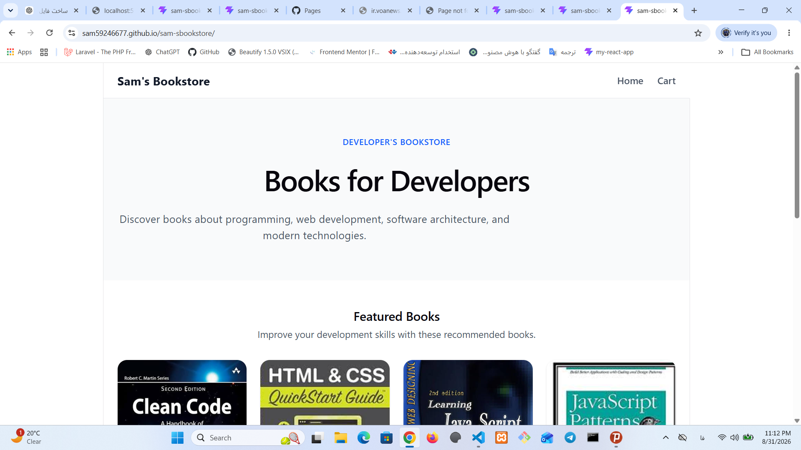
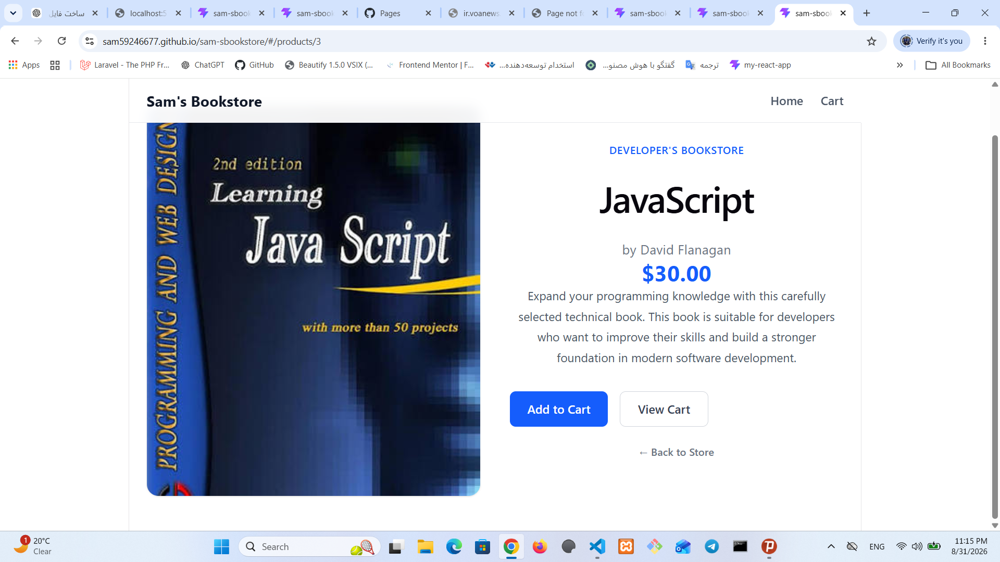
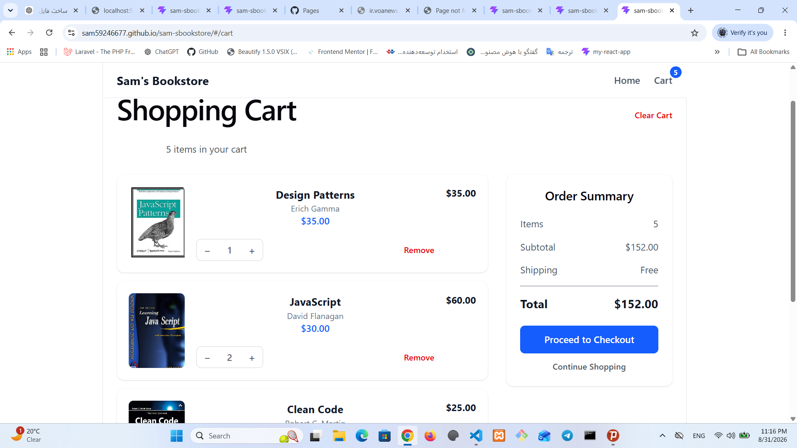
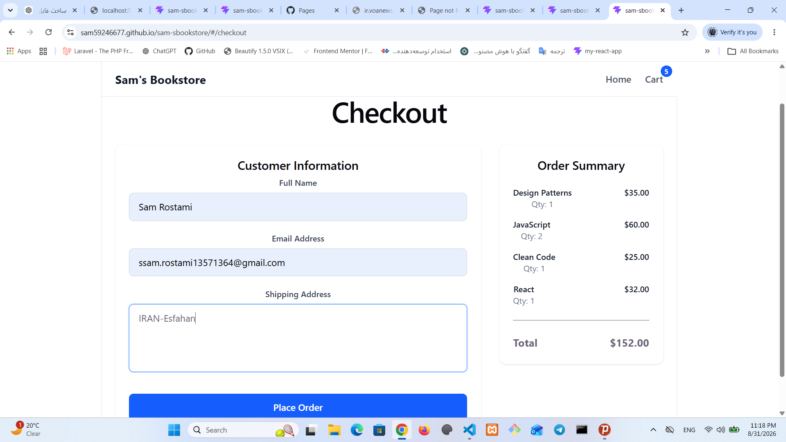
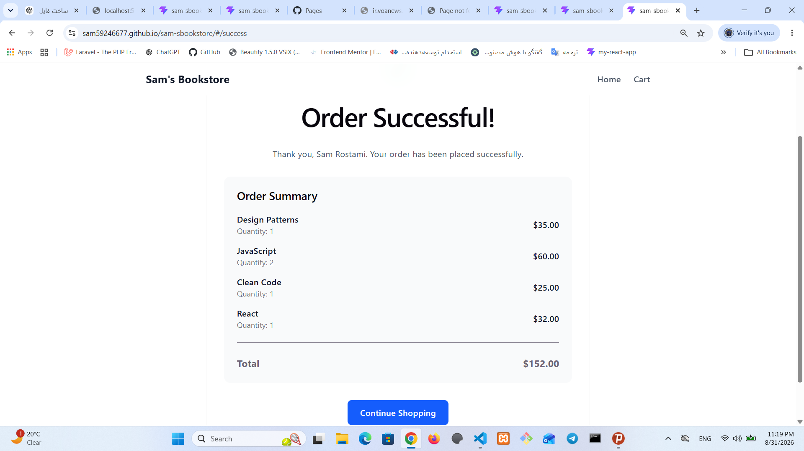

# 📚 Sam's Bookstore

A modern and responsive online bookstore built with **React, TypeScript, Tailwind CSS, and React Router**.

This project demonstrates a complete e-commerce shopping flow where users can browse developer books, view product details, manage their shopping cart, complete checkout, and receive order confirmation.

## 🚀 Live Demo

🔗 https://sam59246677.github.io/sam-sbookstore/

## 📸 Preview

### Home Page



### Product Details



### Shopping Cart



### Checkout



### Order Success



## ✨ Features

* Browse developer and programming books
* View detailed product information
* Add books to shopping cart
* Increase and decrease product quantity
* Remove products from cart
* Clear entire cart
* Automatic total price calculation
* Checkout form validation
* Order confirmation page
* Cart persistence with LocalStorage
* Responsive design for different screen sizes
* Client-side routing with React Router

## 🛠 Technologies Used

* React
* TypeScript
* Tailwind CSS
* React Router
* Vite
* Context API
* LocalStorage
* ESLint
* Git & GitHub

## 📂 Project Structure

```text
src/
│
├── assets/
│   └── images/
│
├── components/
│   ├── Navbar.tsx
│   └── ProductCard.tsx
│
├── context/
│   └── CartContext.tsx
│
├── data/
│   └── products.ts
│
├── pages/
│   ├── Home.tsx
│   ├── ProductDetails.tsx
│   ├── Cart.tsx
│   ├── Checkout.tsx
│   └── Success.tsx
│
├── types/
│   └── product.ts
│
├── App.tsx
├── main.tsx
└── index.css
```

## 🛒 Application Flow

```text
Home
 │
 ├── Product Details
 │        │
 │        └── Add To Cart
 │
 └── Cart
          │
          ├── Update Quantity
          ├── Remove Items
          │
          └── Checkout
                  │
                  └── Order Success
```

## 🧠 Concepts Practiced

This project was created to practice real-world frontend development concepts:

* React component architecture
* TypeScript type safety
* React Hooks
* Context API state management
* Reusable components
* Dynamic routing
* Form handling
* LocalStorage
* Array methods (`map`, `find`, `reduce`)
* Responsive UI development with Tailwind CSS
* Production deployment with Vite and GitHub Pages

## ⚙️ Installation

Clone the repository:

```bash
git clone https://github.com/sam59246677/sam-sbookstore.git
```

Go to the project folder:

```bash
cd sam-sbookstore
```

Install dependencies:

```bash
npm install
```

Run development server:

```bash
npm run dev
```

## 📦 Production Build

Create production build:

```bash
npm run build
```

Deploy to GitHub Pages:

```bash
npm run deploy
```

## 🔮 Future Improvements

Possible improvements:

* Add search functionality
* Add category filtering
* Connect to a real backend API
* Add user authentication
* Add payment integration
* Add dark mode

## 👨‍💻 Author

**Sam Rostami**

Frontend Developer

GitHub:
https://github.com/sam59246677
